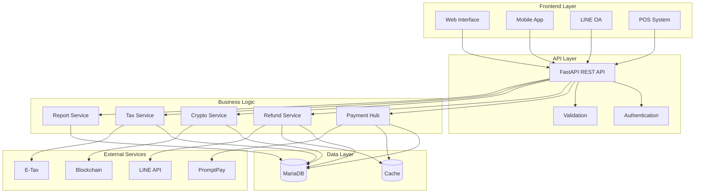
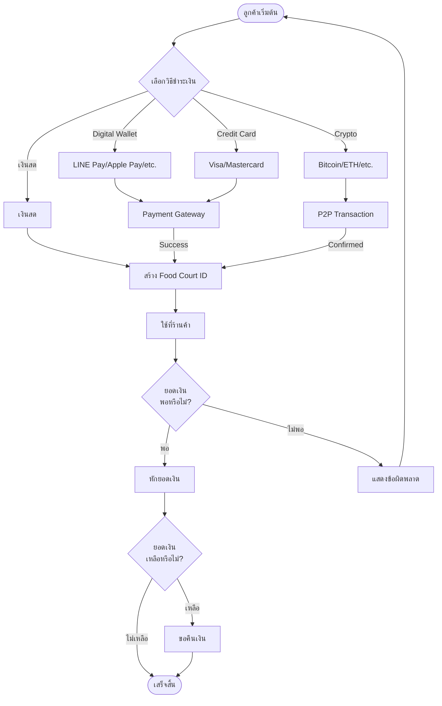
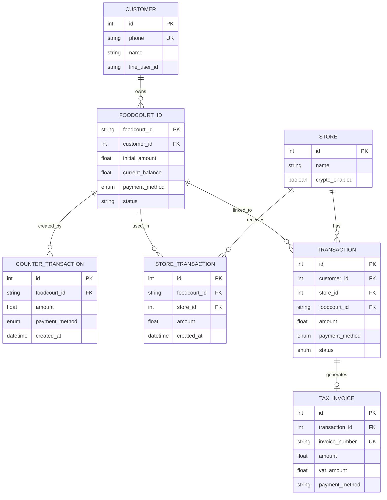
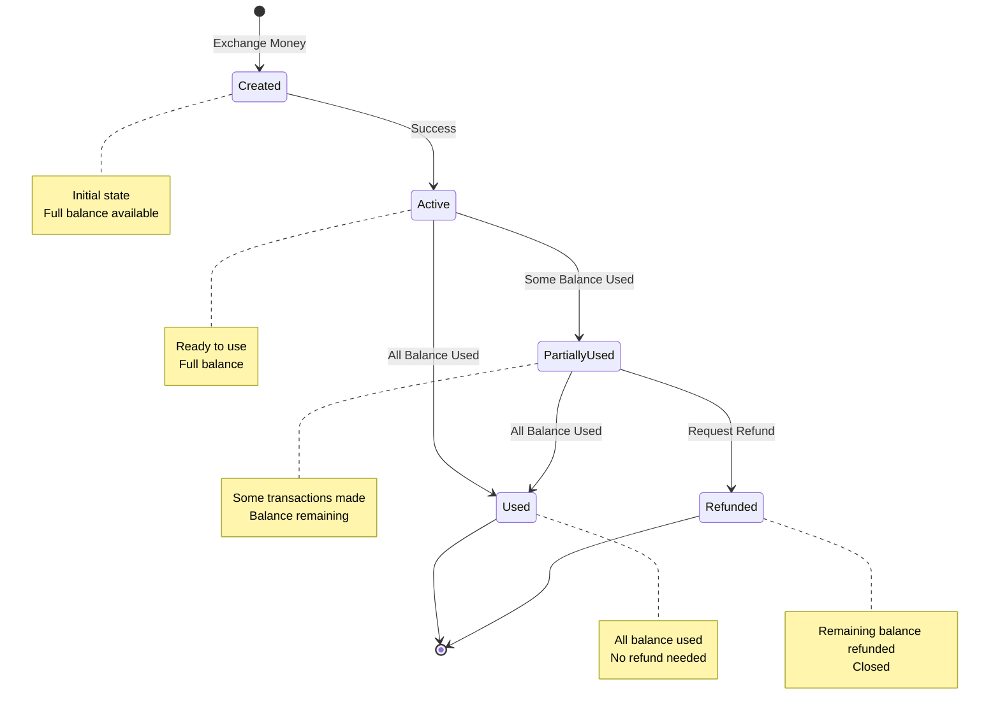
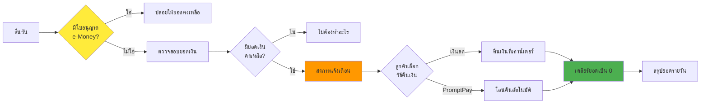
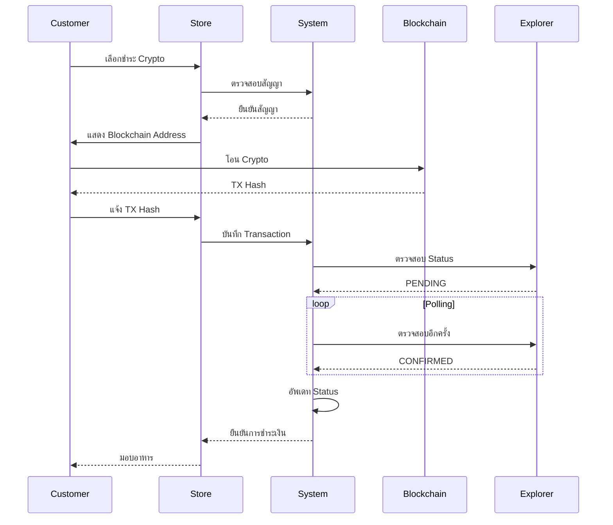
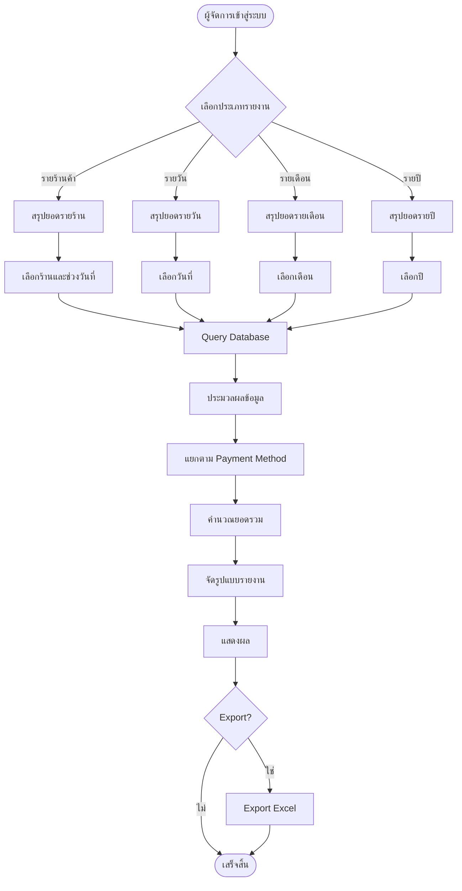
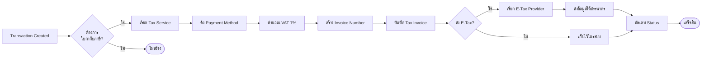
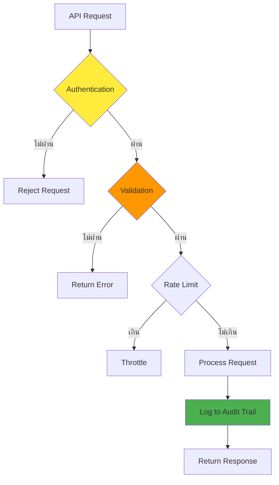

# System Diagrams - Food Court Management System

## 1. System Overview Diagram



## 2. Payment Processing Flow



## 3. Database Entity Relationship



## 4. State Machine - Food Court ID



## 5. E-Money Guard Flow



## 6. Crypto P2P Flow



## 7. Report Generation Flow



## 8. Tax Invoice Generation



## 9. Component Interaction

```mermaid
graph TB
    subgraph "API Endpoints"
        E1[/api/counter/exchange]
        E2[/api/payment-hub/use]
        E3[/api/counter/refund]
        E4[/api/reports/payment/store]
    end
    
    subgraph "Services"
        S1[PaymentHub]
        S2[RefundService]
        S3[ReportService]
    end
    
    subgraph "Models"
        M1[FoodCourtID]
        M2[Transaction]
        M3[Store]
    end
    
    E1 --> S1
    E2 --> S1
    E3 --> S2
    E4 --> S3
    
    S1 --> M1
    S1 --> M2
    S2 --> M1
    S3 --> M2
    S3 --> M3
```

## 10. Security Flow



---

## การใช้งาน Diagrams

Diagrams เหล่านี้ใช้ Mermaid syntax สามารถแสดงผลได้ใน:
- GitHub (รองรับ Mermaid)
- VS Code (ใช้ Mermaid extension)
- Online: https://mermaid.live
- Documentation tools ที่รองรับ Mermaid

