# Food Court Management System - เอกสารระบบ

## สารบัญ

1. [System Architecture](#system-architecture)
2. [Flow Diagrams](#flow-diagrams)
3. [User Experience](#user-experience)
4. [Example Use Cases](#example-use-cases)
5. [API Flow](#api-flow)

---

## System Architecture

### High-Level Architecture


### Database Schema


---

## Flow Diagrams

### 1. Payment Flow - รูปแบบที่ 1 (เงินสดเท่านั้น)

```mermaid
sequenceDiagram
    participant Customer as ลูกค้า
    participant Counter as Counter
    participant System as Payment Hub
    participant Store as ร้านค้า
    participant DB as Database
    
    Customer->>Counter: แลกเงินสด
    Counter->>System: POST /api/counter/exchange<br/>{amount, payment_method: "cash"}
    System->>DB: สร้าง Food Court ID
    DB-->>System: Food Court ID
    System-->>Counter: FC-20241201-12345
    Counter-->>Customer: มอบ Food Court ID
    
    Customer->>Store: สั่งอาหาร
    Store->>System: POST /api/payment-hub/use<br/>{foodcourt_id, store_id, amount}
    System->>DB: หักยอดเงิน
    DB-->>System: ยอดเงินคงเหลือ
    System-->>Store: ยืนยันการชำระเงิน
    
    Customer->>Counter: ขอคืนเงินที่เหลือ
    Counter->>System: POST /api/counter/refund<br/>{foodcourt_id}
    System->>DB: อัพเดท status = "refunded"
    System-->>Counter: ยอดเงินที่คืน
    Counter-->>Customer: คืนเงินสด
```



### 2. Payment Flow - รูปแบบที่ 2 (หลายรูปแบบ)

```mermaid
sequenceDiagram
    participant Customer as ลูกค้า
    participant Counter as Counter
    participant Gateway as Payment Gateway
    participant System as Payment Hub
    participant Store as ร้านค้า
    participant DB as Database
    
    Customer->>Counter: เลือกวิธีชำระเงิน<br/>(LINE Pay/Apple Pay/etc.)
    Counter->>Gateway: เรียก Payment Gateway
    Gateway-->>Counter: ยืนยันการชำระเงิน
    Counter->>System: POST /api/counter/exchange<br/>{amount, payment_method, payment_details}
    System->>DB: สร้าง Food Court ID<br/>บันทึก payment_method
    DB-->>System: Food Court ID
    System-->>Counter: FC-20241201-12345
    Counter-->>Customer: มอบ Food Court ID
    
    Customer->>Store: สั่งอาหาร
    Store->>System: POST /api/payment-hub/use<br/>{foodcourt_id, store_id, amount}
    System->>DB: หักยอดเงิน
    DB-->>System: ยอดเงินคงเหลือ
    System-->>Store: ยืนยันการชำระเงิน
    
    Customer->>Counter: ขอคืนเงินที่เหลือ
    Counter->>System: POST /api/counter/refund<br/>{foodcourt_id}
    System->>DB: อัพเดท status = "refunded"
    System-->>Counter: ยอดเงินที่คืน<br/>(พร้อม payment_method)
    Counter->>Gateway: คืนเงินตาม payment_method
    Gateway-->>Counter: ยืนยันการคืนเงิน
    Counter-->>Customer: แจ้งการคืนเงิน
```



### 3. Refund Flow (E-Money Guard)

```mermaid
flowchart TD
    A[ลูกค้ามียอดเงินคงเหลือ] --> B{มีใบอนุญาต<br/>e-Money?}
    
    B -->|ใช่| C[ปล่อยให้ยอดคงเหลือ<br/>Carry Over]
    B -->|ไม่ใช่| D[ส่งการแจ้งเตือน<br/>คืนเงิน]
    
    D --> E{ลูกค้าเลือก<br/>วิธีคืนเงิน}
    E -->|เงินสด| F[รับเงินที่เคาน์เตอร์]
    E -->|PromptPay| G[โอนคืนอัตโนมัติ]
    
    F --> H[เคลียร์ยอดเป็น 0]
    G --> H
    
    H --> I[สรุปยอดรายวัน]
    
    style B fill:#ffeb3b
    style D fill:#ff9800
    style H fill:#4caf50
```



### 4. Crypto Payment Flow (P2P)

```mermaid
sequenceDiagram
    participant Customer as ลูกค้า
    participant Store as ร้านค้า
    participant System as Payment Hub
    participant Blockchain as Blockchain
    participant Explorer as Block Explorer
    
    Customer->>Store: เลือกชำระด้วย Crypto
    Store->>System: ตรวจสอบสัญญา P2P
    System-->>Store: ยืนยันสัญญา
    
    Customer->>Blockchain: โอน Crypto P2P
    Blockchain-->>Customer: Transaction Hash
    
    Customer->>Store: แจ้ง TX Hash
    Store->>System: POST /api/crypto/transactions<br/>{tx_hash, amount}
    System->>Explorer: ตรวจสอบ Transaction Status
    Explorer-->>System: Status: PENDING
    
    loop Polling
        System->>Explorer: ตรวจสอบอีกครั้ง
        Explorer-->>System: Status: CONFIRMED
    end
    
    System->>System: อัพเดท Transaction Status
    System-->>Store: ยืนยันการชำระเงิน
    Store-->>Customer: มอบอาหาร
```



---

## User Experience

### 1. Customer Journey - แลก Food Court ID

#### Scenario: ลูกค้าแลกเงินสด

```
┌─────────────────────────────────────────────────────────┐
│                    COUNTER SCREEN                        │
├─────────────────────────────────────────────────────────┤
│                                                           │
│  ยินดีต้อนรับสู่ Food Court                               │
│                                                           │
│  กรุณาเลือกวิธีชำระเงิน:                                 │
│                                                           │
│  [💵 เงินสด]  [💳 บัตรเครดิต]  [📱 LINE Pay]            │
│  [🍎 Apple Pay]  [📱 PromptPay]  [₿ Crypto]            │
│                                                           │
│  ────────────────────────────────────────                │
│                                                           │
│  จำนวนเงิน: [_______] บาท                                │
│                                                           │
│  [ยืนยัน]                                                │
│                                                           │
└─────────────────────────────────────────────────────────┘

↓ (ลูกค้าเลือกเงินสด 1000 บาท)

┌─────────────────────────────────────────────────────────┐
│                    COUNTER SCREEN                        │
├─────────────────────────────────────────────────────────┤
│                                                           │
│  ✅ การแลกสำเร็จ                                         │
│                                                           │
│  Food Court ID: FC-20241201-12345                        │
│  จำนวนเงิน: 1,000.00 บาท                                 │
│                                                           │
│  ┌─────────────────────────────────────┐                │
│  │  [QR Code]                           │                │
│  │  FC-20241201-12345                   │                │
│  └─────────────────────────────────────┘                │
│                                                           │
│  [พิมพ์ใบเสร็จ]  [ส่ง LINE]                              │
│                                                           │
└─────────────────────────────────────────────────────────┘
```

#### Scenario: ลูกค้าใช้ LINE Pay

```
┌─────────────────────────────────────────────────────────┐
│                    COUNTER SCREEN                        │
├─────────────────────────────────────────────────────────┤
│                                                           │
│  เลือกวิธีชำระเงิน: LINE Pay                              │
│  จำนวนเงิน: 1,000.00 บาท                                 │
│                                                           │
│  ┌─────────────────────────────────────┐                │
│  │  [QR Code สำหรับ LINE Pay]          │                │
│  └─────────────────────────────────────┘                │
│                                                           │
│  กรุณาสแกน QR Code ด้วย LINE App                         │
│                                                           │
│  [ยกเลิก]                                                │
│                                                           │
└─────────────────────────────────────────────────────────┘

↓ (ลูกค้าสแกนและชำระเงิน)

┌─────────────────────────────────────────────────────────┐
│                    COUNTER SCREEN                        │
├─────────────────────────────────────────────────────────┤
│                                                           │
│  ✅ ชำระเงินสำเร็จ                                        │
│                                                           │
│  Food Court ID: FC-20241201-12345                        │
│  จำนวนเงิน: 1,000.00 บาท                                 │
│  วิธีชำระ: LINE Pay                                      │
│                                                           │
│  [พิมพ์ใบเสร็จ]  [ส่ง LINE]                              │
│                                                           │
└─────────────────────────────────────────────────────────┘
```

### 2. Store Experience - รับ Food Court ID

```
┌─────────────────────────────────────────────────────────┐
│                    STORE POS SCREEN                      │
├─────────────────────────────────────────────────────────┤
│                                                           │
│  ร้าน: ร้านอาหารไทย                                        │
│                                                           │
│  ────────────────────────────────────────                │
│                                                           │
│  รายการ:                                                 │
│  1. ข้าวผัดกุ้ง             150.00 บาท                    │
│  2. ต้มยำกุ้ง               120.00 บาท                    │
│                                                           │
│  รวม: 270.00 บาท                                         │
│                                                           │
│  ────────────────────────────────────────                │
│                                                           │
│  กรุณาสแกน Food Court ID:                                │
│                                                           │
│  [📷 สแกน QR Code]  [⌨️  กรอก ID]                        │
│                                                           │
└─────────────────────────────────────────────────────────┘

↓ (สแกน Food Court ID)

┌─────────────────────────────────────────────────────────┐
│                    STORE POS SCREEN                      │
├─────────────────────────────────────────────────────────┤
│                                                           │
│  ✅ การชำระเงินสำเร็จ                                     │
│                                                           │
│  Food Court ID: FC-20241201-12345                        │
│  ยอดเงินคงเหลือ: 730.00 บาท                               │
│                                                           │
│  [พิมพ์ใบเสร็จ]  [สั่งอาหารถัดไป]                        │
│                                                           │
└─────────────────────────────────────────────────────────┘
```

### 3. Customer Experience - ตรวจสอบยอดเงิน

```
┌─────────────────────────────────────────────────────────┐
│              CUSTOMER MOBILE APP / WEB                   │
├─────────────────────────────────────────────────────────┤
│                                                           │
│  ตรวจสอบยอดเงิน                                          │
│                                                           │
│  ┌─────────────────────────────────────┐                │
│  │  [📷 สแกน QR Code]                  │                │
│  │  หรือ                                │                │
│  │  [⌨️  กรอก Food Court ID]            │                │
│  └─────────────────────────────────────┘                │
│                                                           │
│  [ตรวจสอบยอดเงิน]                                        │
│                                                           │
└─────────────────────────────────────────────────────────┘

↓ (สแกน QR Code)

┌─────────────────────────────────────────────────────────┐
│              CUSTOMER MOBILE APP / WEB                   │
├─────────────────────────────────────────────────────────┤
│                                                           │
│  ยอดเงินคงเหลือ                                          │
│                                                           │
│  ┌─────────────────────────────────────┐                │
│  │  จำนวนเงิน                            │                │
│  │  730.00 บาท                          │                │
│  │                                      │                │
│  │  Food Court ID:                      │                │
│  │  FC-20241201-12345                   │                │
│  │                                      │                │
│  │  สถานะ: ใช้งานได้                     │                │
│  └─────────────────────────────────────┘                │
│                                                           │
│  [ขอคืนเงิน]  [ดูประวัติ]                                │
│                                                           │
└─────────────────────────────────────────────────────────┘
```

---

## Example Use Cases

### Use Case 1: ลูกค้าแลกเงินสดและใช้ที่ร้าน

**Actor:** ลูกค้า, พนักงาน Counter, พนักงานร้านค้า

**Preconditions:**
- ระบบทำงานปกติ
- Database เชื่อมต่อได้

**Main Flow:**
1. ลูกค้านำเงินสด 1,000 บาท ไปที่ Counter
2. พนักงาน Counter เปิดระบบแลก Food Court ID
3. พนักงานเลือก "เงินสด" และกรอกจำนวนเงิน 1,000 บาท
4. ระบบสร้าง Food Court ID: `FC-20241201-12345`
5. ระบบพิมพ์ใบเสร็จและ QR Code ให้ลูกค้า
6. ลูกค้าไปที่ร้านอาหารและสั่งอาหาร 270 บาท
7. พนักงานร้านสแกน Food Court ID
8. ระบบหักยอดเงิน 270 บาท เหลือ 730 บาท
9. ลูกค้าได้รับอาหาร
10. ลูกค้าไปที่ Counter เพื่อขอคืนเงินที่เหลือ
11. พนักงาน Counter ตรวจสอบยอดเงินคงเหลือ
12. ระบบคืนเงิน 730 บาท ให้ลูกค้า
13. ระบบอัพเดท status เป็น "refunded"

**Postconditions:**
- Food Court ID ถูกใช้และคืนเงินแล้ว
- ยอดเงินคงเหลือเป็น 0
- มีบันทึก Transaction ทั้งหมด

---

### Use Case 2: ลูกค้าใช้ LINE Pay และใช้หลายร้าน

**Actor:** ลูกค้า, พนักงาน Counter, พนักงานร้านค้า (หลายร้าน)

**Main Flow:**
1. ลูกค้าไปที่ Counter และเลือกชำระด้วย LINE Pay
2. พนักงาน Counter เปิดระบบแลก Food Court ID
3. ระบบแสดง QR Code สำหรับ LINE Pay
4. ลูกค้าสแกน QR Code ด้วย LINE App และชำระเงิน 2,000 บาท
5. ระบบสร้าง Food Court ID: `FC-20241201-67890`
6. ลูกค้าไปที่ร้าน A และสั่งอาหาร 350 บาท
7. ระบบหักยอดเงิน เหลือ 1,650 บาท
8. ลูกค้าไปที่ร้าน B และสั่งเครื่องดื่ม 80 บาท
9. ระบบหักยอดเงิน เหลือ 1,570 บาท
10. ลูกค้าไปที่ร้าน C และสั่งของหวาน 120 บาท
11. ระบบหักยอดเงิน เหลือ 1,450 บาท
12. ลูกค้าไปที่ Counter เพื่อขอคืนเงินที่เหลือ
13. ระบบคืนเงินผ่าน LINE Pay อัตโนมัติ 1,450 บาท
14. ลูกค้าได้รับแจ้งเตือนจาก LINE

**Postconditions:**
- Food Court ID ถูกใช้ที่ 3 ร้าน
- ยอดเงินคงเหลือถูกคืนผ่าน LINE Pay
- มีบันทึก Transaction ทั้งหมด

---

### Use Case 3: ร้านค้ารับ Crypto Payment (P2P)

**Actor:** ลูกค้า, ร้านค้า, ระบบ

**Preconditions:**
- ร้านค้ายอมรับสัญญา P2P แล้ว
- ร้านค้าเปิดใช้งาน Crypto Payment

**Main Flow:**
1. ลูกค้าเลือกชำระด้วย Bitcoin
2. ร้านค้าแสดงที่อยู่ Blockchain Address
3. ลูกค้าโอน Bitcoin ไปยังที่อยู่ที่ระบุ
4. ลูกค้าแจ้ง Transaction Hash ให้ร้านค้า
5. ร้านค้าใส่ TX Hash ในระบบ POS
6. ระบบเรียก Blockchain Explorer API เพื่อตรวจสอบ
7. ระบบแสดงสถานะ: "PENDING"
8. ระบบ polling ตรวจสอบทุก 30 วินาที
9. เมื่อ Transaction confirmed ระบบอัพเดทเป็น "CONFIRMED"
10. ร้านค้าได้รับแจ้งเตือนว่าชำระเงินสำเร็จ
11. ร้านค้ามอบอาหารให้ลูกค้า

**Postconditions:**
- Transaction ถูกบันทึกในระบบ
- มี link ไปยัง Blockchain Explorer
- ร้านค้าได้รับยืนยันการชำระเงิน

---

### Use Case 4: ระบบแจ้งเตือนคืนเงิน (E-Money Guard)

**Actor:** ระบบ, ลูกค้า

**Preconditions:**
- ไม่มีใบอนุญาต e-Money
- ลูกค้ามียอดเงินคงเหลือ

**Main Flow:**
1. ระบบตรวจสอบยอดเงินคงเหลือของลูกค้าทุกวันเวลา 23:00
2. ระบบพบว่าลูกค้ามียอดเงิน 500 บาท
3. ระบบส่งการแจ้งเตือนผ่าน LINE OA
4. ลูกค้าได้รับข้อความ:
   ```
   คุณมียอดเงินคงเหลือ 500.00 บาท
   กรุณาเลือกวิธีรับเงินคืน:
   [รับเงินสดที่เคาน์เตอร์]
   [โอนคืนผ่าน PromptPay]
   ```
5. ลูกค้าเลือก "โอนคืนผ่าน PromptPay"
6. ระบบประมวลผลการคืนเงิน
7. ระบบโอนเงิน 500 บาท ไปยัง PromptPay ของลูกค้า
8. ระบบเคลียร์ยอดเงินคงเหลือเป็น 0
9. ลูกค้าได้รับแจ้งเตือนว่าคืนเงินสำเร็จ

**Postconditions:**
- ยอดเงินคงเหลือเป็น 0
- ลูกค้าได้รับเงินคืนแล้ว
- มีบันทึก Refund Request

---

### Use Case 5: สรุปยอดรายร้านค้า

**Actor:** ผู้จัดการ, ระบบ

**Main Flow:**
1. ผู้จัดการเข้าสู่ระบบรายงาน
2. ผู้จัดการเลือก "สรุปยอดรายร้านค้า"
3. ผู้จัดการเลือกร้านค้าและช่วงวันที่
4. ระบบดึงข้อมูลจาก Database
5. ระบบแสดงรายงาน:
   - ยอดรวมทั้งหมด
   - จำนวนรายการ
   - แยกตาม Payment Method
   - รายละเอียดแต่ละ Transaction
6. ผู้จัดการสามารถ Export เป็น Excel
7. ผู้จัดการสามารถออกใบกำกับภาษี

**Postconditions:**
- มีรายงานสรุปยอด
- สามารถ Export ได้
- มี Audit Trail

---

## API Flow

### Complete API Request Flow


---

## System Components

### 1. Payment Hub
- **หน้าที่:** จัดการการแลกและใช้ Food Court ID
- **Input:** จำนวนเงิน, Payment Method
- **Output:** Food Court ID, ยอดเงินคงเหลือ

### 2. Refund Service
- **หน้าที่:** จัดการการคืนเงิน
- **Features:** E-Money Guard, Auto Notification

### 3. Crypto Service
- **หน้าที่:** จัดการ Crypto Payment (P2P)
- **Features:** Transaction Monitoring, Contract Management

### 4. Tax Service
- **หน้าที่:** จัดการภาษีและใบกำกับภาษี
- **Features:** VAT Calculation, WHT, E-Tax Integration

### 5. Report Service
- **หน้าที่:** สร้างรายงานสรุปยอด
- **Features:** Daily/Monthly/Yearly Reports, Store Summary

---

## Security & Compliance

### 1. E-Money Compliance
- ระบบแจ้งเตือนคืนเงินอัตโนมัติ
- Daily Balance Reset (เมื่อไม่มีใบอนุญาต)
- Audit Trail

### 2. Crypto P2P Compliance
- E-Contract สำหรับร้านค้า
- Disclaimer ชัดเจน
- Transaction Monitoring (Information Only)

### 3. Tax Compliance
- ใบกำกับภาษีอย่างย่อ (ภ.พ. 89)
- E-Tax Invoice Integration
- Sales Tax Report

---

## Technology Stack

- **Backend:** FastAPI (Python)
- **Database:** MariaDB
- **ORM:** SQLAlchemy
- **API Documentation:** Swagger/OpenAPI
- **Testing:** Pytest
- **Deployment:** Uvicorn

---

## Contact & Support

สำหรับคำถามหรือปัญหาการใช้งาน กรุณาติดต่อทีมพัฒนา

